# 🏗️ Diagramme UML de l'Application Addproduct

## 📊 Vue d'ensemble de l'Architecture

Cette application de gestion de recettes suit une architecture MVC (Model-View-Controller) avec un frontend React et un backend Express.js.

## 🎯 Diagramme de Classes Principal

```mermaid
classDiagram
    %% ===========================================
    %% COUCHE BACKEND (API & LOGIQUE MÉTIER)
    %% ===========================================

    %% Modèles de données
    class User {
        -id: number
        -username: string
        -email: string
        -password: string
        -first_name: string
        -last_name: string
        -country: string
        -avatar_url: string
        -created_at: datetime
        -updated_at: datetime
        +validate(): ValidationResult
        +create(hashedPassword): Promise~number~
        +update(hashedPassword): Promise~Result~
        +delete(): Promise~Result~
        +getFullName(): string
        +getInitials(): string
        +getPublicData(): Object
        +toJSON(): Object
        +findById(id): Promise~User~
        +findByLoginField(loginField): Promise~User~
        +exists(username, email): Promise~boolean~
        +findAll(): Promise~Array~
    }

    class Recipe {
        -id: number
        -title: string
        -description: string
        -ingredients: string
        -instructions: string
        -prep_time: number
        -cook_time: number
        -servings: number
        -difficulty: string
        -image_url: string
        -video_url: string
        -user_id: number
        -is_shared: boolean
        -share_message: string
        -allow_comments: boolean
        -show_author_info: boolean
        -shared_at: datetime
        -created_at: datetime
        -updated_at: datetime
        +validate(): ValidationResult
        +create(): Promise~number~
        +update(): Promise~Result~
        +delete(): Promise~Result~
        +share(shareOptions): Promise~Result~
        +toJSON(): Object
        +findById(id): Promise~Recipe~
        +findAll(userId): Promise~Array~
        +findShared(limit): Promise~Array~
        +belongsToUser(recipeId, userId): Promise~boolean~
    }

    class Favorite {
        -id: number
        -user_id: number
        -recipe_id: number
        -created_at: datetime
        +create(): Promise~number~
        +delete(): Promise~Result~
        +findByUser(userId): Promise~Array~
        +findByRecipe(recipeId): Promise~Array~
        +exists(userId, recipeId): Promise~boolean~
    }

    class Comment {
        -id: number
        -user_id: number
        -recipe_id: number
        -content: string
        -created_at: datetime
        -updated_at: datetime
        +create(): Promise~number~
        +update(): Promise~Result~
        +delete(): Promise~Result~
        +findByRecipe(recipeId): Promise~Array~
        +findByUser(userId): Promise~Array~
    }

    class Badge {
        -id: number
        -name: string
        -description: string
        -icon: string
        -criteria: string
        +findAll(): Promise~Array~
        +findById(id): Promise~Badge~
    }

    class Follow {
        -id: number
        -follower_id: number
        -following_id: number
        -created_at: datetime
        +create(): Promise~number~
        +delete(): Promise~Result~
        +findFollowers(userId): Promise~Array~
        +findFollowing(userId): Promise~Array~
    }

    %% Contrôleurs
    class UserController {
        +register(req, res): Promise~void~
        +login(req, res): Promise~void~
        +getProfile(req, res): Promise~void~
        +updateProfile(req, res): Promise~void~
        +deleteProfile(req, res): Promise~void~
        +getAllUsers(req, res): Promise~void~
    }

    class RecipeController {
        +createRecipe(req, res): Promise~void~
        +getRecipe(req, res): Promise~void~
        +getAllRecipes(req, res): Promise~void~
        +getUserRecipes(req, res): Promise~void~
        +getSharedRecipes(req, res): Promise~void~
        +updateRecipe(req, res): Promise~void~
        +deleteRecipe(req, res): Promise~void~
        +shareRecipe(req, res): Promise~void~
        +searchRecipes(req, res): Promise~void~
    }

    class FavoriteController {
        +addFavorite(req, res): Promise~void~
        +removeFavorite(req, res): Promise~void~
        +getUserFavorites(req, res): Promise~void~
        +checkFavorite(req, res): Promise~void~
    }

    class CommentController {
        +addComment(req, res): Promise~void~
        +getComments(req, res): Promise~void~
        +updateComment(req, res): Promise~void~
        +deleteComment(req, res): Promise~void~
    }

    class CommunityController {
        +getLeaderboard(req, res): Promise~void~
        +getUserStats(req, res): Promise~void~
        +getBadges(req, res): Promise~void~
        +assignBadge(req, res): Promise~void~
    }

    class FridgeAssistantController {
        +getSuggestions(req, res): Promise~void~
        +analyzeIngredients(req, res): Promise~void~
        +getRecipesByIngredients(req, res): Promise~void~
    }

    %% Middlewares
    class AuthMiddleware {
        +authenticate(req, res, next): void
        +optionalAuth(req, res, next): void
        +validateToken(token): Promise~User~
    }

    class ValidationMiddleware {
        +validateUser(req, res, next): void
        +validateRecipe(req, res, next): void
        +validateComment(req, res, next): void
    }

    class ErrorHandler {
        +handleError(err, req, res, next): void
        +notFound(req, res, next): void
    }

    %% ===========================================
    %% COUCHE FRONTEND (REACT COMPONENTS)
    %% ===========================================

    %% Composants d'authentification
    class AuthManager {
        +login(credentials): Promise~AuthResult~
        +register(userData): Promise~AuthResult~
        +logout(): void
        +getCurrentUser(): User
        +isAuthenticated(): boolean
    }

    class LoginForm {
        -email: string
        -password: string
        -loading: boolean
        -error: string
        +handleSubmit(): void
        +handleChange(): void
        +render(): JSX
    }

    class RegisterForm {
        -formData: Object
        -loading: boolean
        -error: string
        +handleSubmit(): void
        +handleChange(): void
        +validateForm(): boolean
        +render(): JSX
    }

    %% Composants de recettes
    class RecipeCard {
        -recipe: Recipe
        -isFavorite: boolean
        -onFavorite: Function
        -onShare: Function
        -onEdit: Function
        -onDelete: Function
        +handleFavorite(): void
        +handleShare(): void
        +handleEdit(): void
        +handleDelete(): void
        +render(): JSX
    }

    class RecipeForm {
        -recipe: Recipe
        -isEditing: boolean
        -loading: boolean
        -errors: Object
        +handleSubmit(): void
        +handleChange(): void
        +validateForm(): boolean
        +handleImageUpload(): void
        +handleVideoUpload(): void
        +render(): JSX
    }

    class RecipeList {
        -recipes: Array~Recipe~
        -loading: boolean
        -error: string
        -onRecipeSelect: Function
        +loadRecipes(): void
        +handleSearch(): void
        +handleFilter(): void
        +render(): JSX
    }

    class RecipeDetails {
        -recipe: Recipe
        -comments: Array~Comment~
        -isFavorite: boolean
        -loading: boolean
        +loadRecipe(): void
        +loadComments(): void
        +handleFavorite(): void
        +handleComment(): void
        +render(): JSX
    }

    %% Composants de partage
    class ShareModal {
        -recipe: Recipe
        -isOpen: boolean
        -shareOptions: Object
        +handleShare(): void
        +handleClose(): void
        +handleOptionChange(): void
        +render(): JSX
    }

    class ShareButton {
        -recipe: Recipe
        -variant: string
        -onShare: Function
        +handleClick(): void
        +render(): JSX
    }

    %% Composants communautaires
    class CommunityExplorer {
        -users: Array~User~
        -recipes: Array~Recipe~
        -loading: boolean
        +loadUsers(): void
        +loadRecipes(): void
        +handleFollow(): void
        +handleUnfollow(): void
        +render(): JSX
    }

    class Leaderboard {
        -users: Array~User~
        -badges: Array~Badge~
        -loading: boolean
        +loadLeaderboard(): void
        +loadBadges(): void
        +render(): JSX
    }

    %% Composants de favoris
    class FavoritesPage {
        -favorites: Array~Recipe~
        -loading: boolean
        -error: string
        +loadFavorites(): void
        +removeFavorite(): void
        +render(): JSX
    }

    %% Composants d'assistant vide-frigo
    class FridgeAssistant {
        -ingredients: Array~string~
        -suggestions: Array~Recipe~
        -loading: boolean
        +analyzeIngredients(): void
        +getSuggestions(): void
        +addIngredient(): void
        +removeIngredient(): void
        +render(): JSX
    }

    %% Services API
    class RecipeService {
        +createRecipe(recipeData): Promise~Recipe~
        +getRecipe(id): Promise~Recipe~
        +getAllRecipes(): Promise~Array~
        +getUserRecipes(userId): Promise~Array~
        +getSharedRecipes(): Promise~Array~
        +updateRecipe(id, recipeData): Promise~Recipe~
        +deleteRecipe(id): Promise~void~
        +searchRecipes(query): Promise~Array~
    }

    class UserService {
        +login(credentials): Promise~AuthResult~
        +register(userData): Promise~AuthResult~
        +getProfile(): Promise~User~
        +updateProfile(userData): Promise~User~
        +deleteProfile(): Promise~void~
    }

    class FavoriteService {
        +addFavorite(recipeId): Promise~void~
        +removeFavorite(recipeId): Promise~void~
        +getFavorites(): Promise~Array~
        +checkFavorite(recipeId): Promise~boolean~
    }

    %% Hooks personnalisés
    class useRecipes {
        -recipes: Array~Recipe~
        -loading: boolean
        -error: string
        +loadRecipes(): void
        +createRecipe(): void
        +updateRecipe(): void
        +deleteRecipe(): void
        +searchRecipes(): void
    }

    class useAuth {
        -user: User
        -isAuthenticated: boolean
        -loading: boolean
        +login(): void
        +logout(): void
        +register(): void
        +checkAuth(): void
    }

    class useFavorites {
        -favorites: Array~Recipe~
        -loading: boolean
        +loadFavorites(): void
        +addFavorite(): void
        +removeFavorite(): void
        +checkFavorite(): boolean
    }

    %% ===========================================
    %% RELATIONS ENTRE LES CLASSES
    %% ===========================================

    %% Relations Backend
    User ||--o{ Recipe : "possède"
    User ||--o{ Favorite : "a des favoris"
    User ||--o{ Comment : "écrit des commentaires"
    User ||--o{ Follow : "suit d'autres utilisateurs"
    Recipe ||--o{ Favorite : "peut être favori"
    Recipe ||--o{ Comment : "peut avoir des commentaires"
    User ||--o{ Badge : "peut avoir des badges"

    %% Relations Contrôleurs-Modèles
    UserController --> User : "utilise"
    RecipeController --> Recipe : "utilise"
    FavoriteController --> Favorite : "utilise"
    CommentController --> Comment : "utilise"
    CommunityController --> Badge : "utilise"
    CommunityController --> User : "utilise"

    %% Relations Frontend
    AuthManager --> UserService : "utilise"
    RecipeCard --> RecipeService : "utilise"
    RecipeForm --> RecipeService : "utilise"
    RecipeList --> RecipeService : "utilise"
    FavoritesPage --> FavoriteService : "utilise"
    ShareModal --> RecipeService : "utilise"

    %% Relations Hooks-Services
    useRecipes --> RecipeService : "utilise"
    useAuth --> UserService : "utilise"
    useFavorites --> FavoriteService : "utilise"

    %% Relations Composants-Hooks
    RecipeList --> useRecipes : "utilise"
    AuthManager --> useAuth : "utilise"
    FavoritesPage --> useFavorites : "utilise"
```

## 🔄 Diagramme de Séquence - Création d'une Recette

```mermaid
sequenceDiagram
    participant U as Utilisateur
    participant RF as RecipeForm
    participant RS as RecipeService
    participant RC as RecipeController
    participant R as Recipe (Model)
    participant DB as Base de Données

    U->>RF: Remplit le formulaire
    RF->>RF: Valide les données
    RF->>RS: createRecipe(recipeData)
    RS->>RC: POST /api/recipes
    RC->>R: new Recipe(data)
    R->>R: validate()
    R->>DB: INSERT INTO recipes
    DB-->>R: recipeId
    R-->>RC: Recipe object
    RC-->>RS: JSON response
    RS-->>RF: Recipe data
    RF->>U: Affiche confirmation
```



## 🌐 Diagramme d'Architecture Globale


## 📋 Résumé des Fonctionnalités Principales

### 🔐 Authentification

- Inscription/Connexion utilisateurs
- Gestion des profils
- Protection des routes

### 🍽️ Gestion des Recettes

- CRUD complet des recettes
- Upload d'images et vidéos
- Système de recherche et filtres
- Partage public/privé

### ❤️ Système de Favoris

- Ajout/suppression de favoris
- Page dédiée aux favoris
- Persistance des préférences

### 👥 Communauté

- Système de suivi d'utilisateurs
- Commentaires sur les recettes
- Tableau de classement
- Système de badges

### 🤖 Assistant Vide-Frigo

- Analyse des ingrédients disponibles
- Suggestions de recettes
- Interface intuitive

### 🌍 Internationalisation

- Support multilingue
- Sélecteur de langue
- Traduction automatique

Cette architecture suit les meilleures pratiques de développement avec une séparation claire des responsabilités, une logique métier centralisée et une interface utilisateur réactive.
