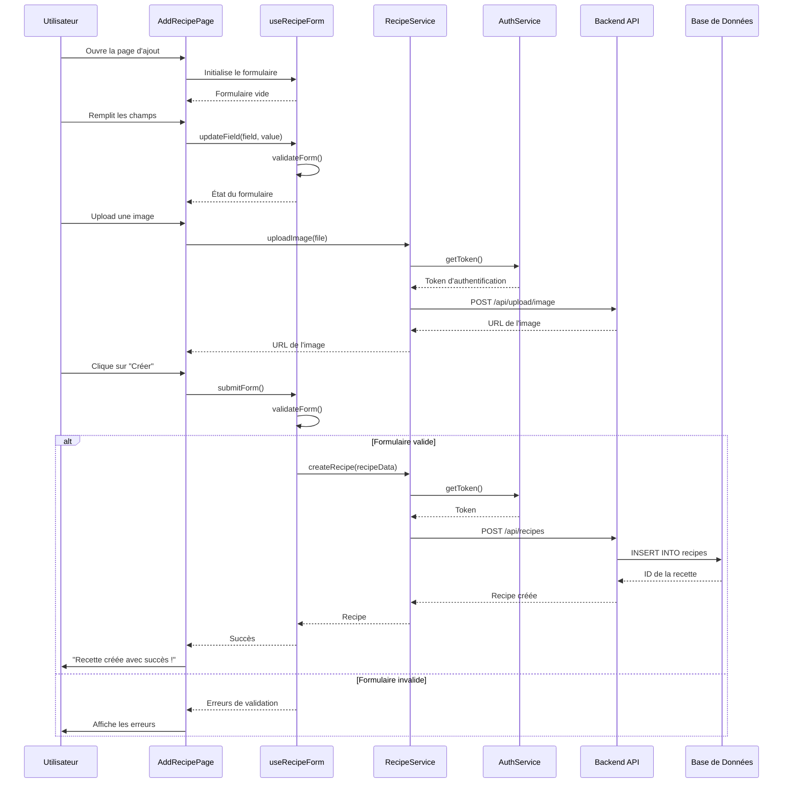
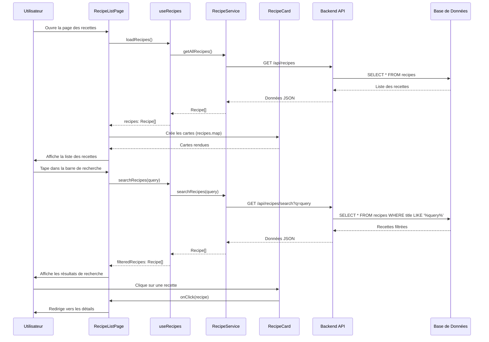
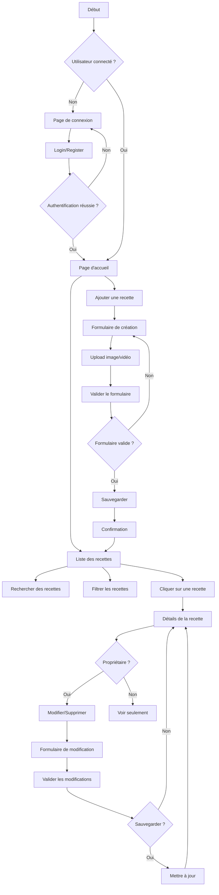

# 🍽️ UML avec Relations et Explications Claires

## 📋 DIAGRAMME DE CLASSES UML DÉTAILLÉ

```mermaid
classDiagram
    %% ===========================================
    %% ENTITÉS PRINCIPALES (MODÈLES)
    %% ===========================================

    class User {
        -id: number
        -username: string
        -email: string
        -password: string
        -first_name: string
        -last_name: string
        -created_at: datetime
        +login(credentials): boolean
        +register(userData): boolean
        +getProfile(): User
        +updateProfile(): User
        +deleteProfile(): void
    }

    class Recipe {
        -id: number
        -title: string
        -description: string
        -ingredients: string
        -instructions: string
        -prep_time: number
        -cook_time: number
        -servings: number
        -difficulty: string
        -image_url: string
        -video_url: string
        -user_id: number
        -created_at: datetime
        -updated_at: datetime
        +create(): Promise~number~
        +update(): Promise~boolean~
        +delete(): Promise~boolean~
        +getAll(): Promise~Recipe[]~
        +getById(id): Promise~Recipe~
        +search(query): Promise~Recipe[]~
    }

    %% ===========================================
    %% PAGES PRINCIPALES (VUES)
    %% ===========================================

    class AddRecipePage {
        -title: string
        -description: string
        -ingredients: string
        -instructions: string
        -prep_time: number
        -cook_time: number
        -servings: number
        -difficulty: string
        -image: File
        -video: File
        -loading: boolean
        -errors: object
        +handleInputChange(): void
        +handleImageUpload(): void
        +handleVideoUpload(): void
        +validateForm(): boolean
        +handleSubmit(): void
        +render(): JSX
    }

    class RecipeListPage {
        -recipes: Recipe[]
        -filteredRecipes: Recipe[]
        -searchQuery: string
        -loading: boolean
        -error: string
        -currentUser: User
        +loadRecipes(): void
        +searchRecipes(query): void
        +filterRecipes(criteria): void
        +handleRecipeClick(recipe): void
        +handleEditRecipe(recipe): void
        +handleDeleteRecipe(recipe): void
        +render(): JSX
    }

    class RecipeDetailsPage {
        -recipe: Recipe
        -loading: boolean
        -error: string
        -isOwner: boolean
        +loadRecipe(id): void
        +handleEdit(): void
        +handleDelete(): void
        +handleShare(): void
        +render(): JSX
    }

    %% ===========================================
    %% COMPOSANTS RÉUTILISABLES
    %% ===========================================

    class RecipeCard {
        -recipe: Recipe
        -isOwner: boolean
        -onClick: function
        -onEdit: function
        -onDelete: function
        -onShare: function
        +handleClick(): void
        +handleEdit(): void
        +handleDelete(): void
        +handleShare(): void
        +render(): JSX
    }

    class RecipeForm {
        -recipe: Recipe
        -isEditing: boolean
        -loading: boolean
        -errors: object
        -onSubmit: function
        -onCancel: function
        +handleInputChange(): void
        +handleImageUpload(): void
        +handleVideoUpload(): void
        +validateForm(): boolean
        +handleSubmit(): void
        +handleCancel(): void
        +render(): JSX
    }

    class SearchBar {
        -query: string
        -placeholder: string
        -onSearch: function
        +handleInputChange(): void
        +handleSubmit(): void
        +clearSearch(): void
        +render(): JSX
    }

    %% ===========================================
    %% SERVICES API (COUCHE MÉTIER)
    %% ===========================================

    class RecipeService {
        -baseURL: string
        -token: string
        +createRecipe(recipeData): Promise~Recipe~
        +getAllRecipes(): Promise~Recipe[]~
        +getRecipeById(id): Promise~Recipe~
        +getUserRecipes(userId): Promise~Recipe[]~
        +updateRecipe(id, recipeData): Promise~Recipe~
        +deleteRecipe(id): Promise~boolean~
        +searchRecipes(query): Promise~Recipe[]~
        +uploadImage(file): Promise~string~
        +uploadVideo(file): Promise~string~
    }

    class UserService {
        -baseURL: string
        +login(credentials): Promise~AuthResult~
        +register(userData): Promise~AuthResult~
        +getProfile(): Promise~User~
        +updateProfile(userData): Promise~User~
        +deleteProfile(): Promise~boolean~
        +logout(): void
    }

    class AuthService {
        -token: string
        -user: User
        +isAuthenticated(): boolean
        +getToken(): string
        +setToken(token): void
        +getCurrentUser(): User
        +setCurrentUser(user): void
        +clearAuth(): void
    }

    %% ===========================================
    %% HOOKS PERSONNALISÉS (LOGIQUE RÉACTIVE)
    %% ===========================================

    class useRecipes {
        -recipes: Recipe[]
        -loading: boolean
        -error: string
        -recipeService: RecipeService
        +loadRecipes(): void
        +createRecipe(recipeData): void
        +updateRecipe(id, recipeData): void
        +deleteRecipe(id): void
        +searchRecipes(query): void
        +refreshRecipes(): void
    }

    class useAuth {
        -user: User
        -isAuthenticated: boolean
        -loading: boolean
        -userService: UserService
        -authService: AuthService
        +login(credentials): void
        +register(userData): void
        +logout(): void
        +checkAuth(): void
        +updateProfile(userData): void
    }

    class useRecipeForm {
        -recipe: Recipe
        -loading: boolean
        -errors: object
        -isValid: boolean
        +setRecipe(recipe): void
        +updateField(field, value): void
        +validateForm(): boolean
        +resetForm(): void
        +submitForm(): void
    }

    %% ===========================================
    %% RELATIONS ENTRE LES CLASSES
    %% ===========================================

    %% Relations d'héritage et de composition
    User ||--o{ Recipe : "crée (1:N)"
    RecipeListPage --> RecipeCard : "utilise (1:N)"
    RecipeDetailsPage --> RecipeForm : "utilise (1:1)"
    RecipeListPage --> SearchBar : "utilise (1:1)"

    %% Relations d'utilisation (dépendances)
    AddRecipePage --> RecipeService : "utilise"
    RecipeListPage --> RecipeService : "utilise"
    RecipeDetailsPage --> RecipeService : "utilise"
    RecipeForm --> RecipeService : "utilise"

    AddRecipePage --> UserService : "utilise"
    RecipeListPage --> UserService : "utilise"
    RecipeDetailsPage --> UserService : "utilise"

    %% Relations avec les hooks
    AddRecipePage --> useRecipeForm : "utilise"
    RecipeListPage --> useRecipes : "utilise"
    RecipeListPage --> useAuth : "utilise"
    RecipeDetailsPage --> useAuth : "utilise"

    %% Relations entre services
    RecipeService --> AuthService : "utilise"
    UserService --> AuthService : "utilise"

    %% Relations avec les hooks et services
    useRecipes --> RecipeService : "utilise"
    useAuth --> UserService : "utilise"
    useAuth --> AuthService : "utilise"
    useRecipeForm --> RecipeService : "utilise"
```

## 🔄 DIAGRAMME DE SÉQUENCE - Création d'une Recette



## 🔄 DIAGRAMME DE SÉQUENCE - Consultation des Recettes



## 📱 DIAGRAMME D'ACTIVITÉ - Navigation Complète



## 🎯 EXPLICATIONS DÉTAILLÉES DES RELATIONS

### **1. Relations d'Association (1:N)**

- **User ||--o{ Recipe** : Un utilisateur peut créer plusieurs recettes
- **RecipeListPage --> RecipeCard** : Une page liste contient plusieurs cartes

### **2. Relations de Composition (1:1)**

- **RecipeDetailsPage --> RecipeForm** : Une page de détails contient un formulaire
- **RecipeListPage --> SearchBar** : Une page liste contient une barre de recherche

### **3. Relations de Dépendance**

- **Pages --> Services** : Les pages utilisent les services pour les données
- **Hooks --> Services** : Les hooks utilisent les services pour la logique
- **Services --> AuthService** : Les services utilisent l'authentification

### **4. Relations de Navigation**

- **RecipeCard --> RecipeDetailsPage** : Clic sur une carte → détails
- **AddRecipePage --> RecipeListPage** : Création → retour à la liste

## 🔧 ARCHITECTURE EN COUCHES

```
┌─────────────────────────────────────────┐
│           COUCHE PRÉSENTATION           │
│  (Pages, Composants, Hooks)            │
├─────────────────────────────────────────┤
│           COUCHE MÉTIER                 │
│  (Services, Logique d'application)     │
├─────────────────────────────────────────┤
│           COUCHE DONNÉES                │
│  (API, Base de données)                │
└─────────────────────────────────────────┘
```

Cette architecture UML montre clairement :

- **Les entités** et leurs propriétés
- **Les relations** entre les classes
- **Les flux** de données et d'interactions
- **L'architecture** en couches séparées
- **Les responsabilités** de chaque composant
