# 🍽️ UML COMPLET avec Authentification

## 📋 DIAGRAMME DE CLASSES UML COMPLET

```mermaid
classDiagram
    %% ===========================================
    %% ENTITÉS PRINCIPALES (MODÈLES)
    %% ===========================================

    class User {
        -id: number
        -username: string
        -email: string
        -password: string
        -first_name: string
        -last_name: string
        -country: string
        -avatar_url: string
        -created_at: datetime
        -updated_at: datetime
        +login(credentials): Promise~AuthResult~
        +register(userData): Promise~AuthResult~
        +getProfile(): Promise~User~
        +updateProfile(): Promise~User~
        +deleteProfile(): Promise~boolean~
        +validate(): ValidationResult
        +getFullName(): string
        +getInitials(): string
        +getPublicData(): object
    }

    class Recipe {
        -id: number
        -title: string
        -description: string
        -ingredients: string
        -instructions: string
        -prep_time: number
        -cook_time: number
        -servings: number
        -difficulty: string
        -image_url: string
        -video_url: string
        -user_id: number
        -is_shared: boolean
        -created_at: datetime
        -updated_at: datetime
        +create(): Promise~number~
        +update(): Promise~boolean~
        +delete(): Promise~boolean~
        +getAll(): Promise~Recipe[]~
        +getById(id): Promise~Recipe~
        +search(query): Promise~Recipe[]~
        +validate(): ValidationResult
    }

    class Favorite {
        -id: number
        -user_id: number
        -recipe_id: number
        -created_at: datetime
        +create(): Promise~number~
        +delete(): Promise~boolean~
        +getByUser(userId): Promise~Favorite[]~
        +getByRecipe(recipeId): Promise~Favorite[]~
        +exists(userId, recipeId): Promise~boolean~
    }

    class Comment {
        -id: number
        -user_id: number
        -recipe_id: number
        -content: string
        -created_at: datetime
        -updated_at: datetime
        +create(): Promise~number~
        +update(): Promise~boolean~
        +delete(): Promise~boolean~
        +getByRecipe(recipeId): Promise~Comment[]~
        +getByUser(userId): Promise~Comment[]~
    }

    %% ===========================================
    %% PAGES D'AUTHENTIFICATION
    %% ===========================================

    class LoginPage {
        -email: string
        -password: string
        -loading: boolean
        -error: string
        -rememberMe: boolean
        +handleInputChange(): void
        +handleSubmit(): void
        +handleForgotPassword(): void
        +handleRegister(): void
        +validateForm(): boolean
        +render(): JSX
    }

    class RegisterPage {
        -username: string
        -email: string
        -password: string
        -confirmPassword: string
        -first_name: string
        -last_name: string
        -country: string
        -loading: boolean
        -error: string
        -acceptTerms: boolean
        +handleInputChange(): void
        +handleSubmit(): void
        +handleLogin(): void
        +validateForm(): boolean
        +validatePassword(): boolean
        +render(): JSX
    }

    class ForgotPasswordPage {
        -email: string
        -loading: boolean
        -error: string
        -success: boolean
        +handleInputChange(): void
        +handleSubmit(): void
        +handleBackToLogin(): void
        +validateEmail(): boolean
        +render(): JSX
    }

    class ResetPasswordPage {
        -password: string
        -confirmPassword: string
        -token: string
        -loading: boolean
        -error: string
        -success: boolean
        +handleInputChange(): void
        +handleSubmit(): void
        +validateForm(): boolean
        +render(): JSX
    }

    %% ===========================================
    %% PAGES PRINCIPALES
    %% ===========================================

    class DashboardPage {
        -user: User
        -recentRecipes: Recipe[]
        -favoriteRecipes: Recipe[]
        -stats: object
        -loading: boolean
        +loadUserData(): void
        +loadRecentRecipes(): void
        +loadFavoriteRecipes(): void
        +loadStats(): void
        +handleLogout(): void
        +render(): JSX
    }

    class AddRecipePage {
        -title: string
        -description: string
        -ingredients: string
        -instructions: string
        -prep_time: number
        -cook_time: number
        -servings: number
        -difficulty: string
        -image: File
        -video: File
        -loading: boolean
        -errors: object
        +handleInputChange(): void
        +handleImageUpload(): void
        +handleVideoUpload(): void
        +validateForm(): boolean
        +handleSubmit(): void
        +render(): JSX
    }

    class RecipeListPage {
        -recipes: Recipe[]
        -filteredRecipes: Recipe[]
        -searchQuery: string
        -loading: boolean
        -error: string
        -currentUser: User
        +loadRecipes(): void
        +searchRecipes(query): void
        +filterRecipes(criteria): void
        +handleRecipeClick(recipe): void
        +handleEditRecipe(recipe): void
        +handleDeleteRecipe(recipe): void
        +render(): JSX
    }

    class RecipeDetailsPage {
        -recipe: Recipe
        -comments: Comment[]
        -loading: boolean
        -error: string
        -isOwner: boolean
        -isFavorite: boolean
        +loadRecipe(id): void
        +loadComments(): void
        +handleEdit(): void
        +handleDelete(): void
        +handleFavorite(): void
        +handleShare(): void
        +render(): JSX
    }

    class FavoritesPage {
        -favorites: Recipe[]
        -loading: boolean
        -error: string
        -currentUser: User
        +loadFavorites(): void
        +removeFavorite(recipeId): void
        +handleRecipeClick(recipe): void
        +render(): JSX
    }

    class ProfilePage {
        -user: User
        -userRecipes: Recipe[]
        -userStats: object
        -loading: boolean
        -error: string
        -isEditing: boolean
        +loadUserProfile(): void
        +loadUserRecipes(): void
        +loadUserStats(): void
        +handleEditProfile(): void
        +handleUpdateProfile(): void
        +handleDeleteAccount(): void
        +render(): JSX
    }

    %% ===========================================
    %% COMPOSANTS RÉUTILISABLES
    %% ===========================================

    class AuthForm {
        -type: string
        -loading: boolean
        -error: string
        -onSubmit: function
        -onCancel: function
        +handleSubmit(): void
        +handleCancel(): void
        +render(): JSX
    }

    class RecipeCard {
        -recipe: Recipe
        -isOwner: boolean
        -isFavorite: boolean
        -onClick: function
        -onEdit: function
        -onDelete: function
        -onFavorite: function
        -onShare: function
        +handleClick(): void
        +handleEdit(): void
        +handleDelete(): void
        +handleFavorite(): void
        +handleShare(): void
        +render(): JSX
    }

    class RecipeForm {
        -recipe: Recipe
        -isEditing: boolean
        -loading: boolean
        -errors: object
        -onSubmit: function
        -onCancel: function
        +handleInputChange(): void
        +handleImageUpload(): void
        +handleVideoUpload(): void
        +validateForm(): boolean
        +handleSubmit(): void
        +handleCancel(): void
        +render(): JSX
    }

    class SearchBar {
        -query: string
        -placeholder: string
        -onSearch: function
        +handleInputChange(): void
        +handleSubmit(): void
        +clearSearch(): void
        +render(): JSX
    }

    class Navbar {
        -user: User
        -isAuthenticated: boolean
        -onLogout: function
        +handleLogout(): void
        +handleProfile(): void
        +render(): JSX
    }

    class CommentForm {
        -content: string
        -loading: boolean
        -error: string
        -onSubmit: function
        +handleInputChange(): void
        +handleSubmit(): void
        +render(): JSX
    }

    class CommentList {
        -comments: Comment[]
        -loading: boolean
        -error: string
        -currentUser: User
        +loadComments(): void
        +handleEditComment(): void
        +handleDeleteComment(): void
        +render(): JSX
    }

    %% ===========================================
    %% SERVICES API
    %% ===========================================

    class AuthService {
        -baseURL: string
        -token: string
        +login(credentials): Promise~AuthResult~
        +register(userData): Promise~AuthResult~
        +forgotPassword(email): Promise~boolean~
        +resetPassword(token, password): Promise~boolean~
        +logout(): void
        +isAuthenticated(): boolean
        +getToken(): string
        +setToken(token): void
        +getCurrentUser(): User
        +setCurrentUser(user): void
        +clearAuth(): void
    }

    class RecipeService {
        -baseURL: string
        -token: string
        +createRecipe(recipeData): Promise~Recipe~
        +getAllRecipes(): Promise~Recipe[]~
        +getRecipeById(id): Promise~Recipe~
        +getUserRecipes(userId): Promise~Recipe[]~
        +updateRecipe(id, recipeData): Promise~Recipe~
        +deleteRecipe(id): Promise~boolean~
        +searchRecipes(query): Promise~Recipe[]~
        +uploadImage(file): Promise~string~
        +uploadVideo(file): Promise~string~
    }

    class FavoriteService {
        -baseURL: string
        -token: string
        +addFavorite(recipeId): Promise~boolean~
        +removeFavorite(recipeId): Promise~boolean~
        +getFavorites(): Promise~Recipe[]~
        +checkFavorite(recipeId): Promise~boolean~
    }

    class CommentService {
        -baseURL: string
        -token: string
        +addComment(recipeId, content): Promise~Comment~
        +getComments(recipeId): Promise~Comment[]~
        +updateComment(id, content): Promise~Comment~
        +deleteComment(id): Promise~boolean~
    }

    class UserService {
        -baseURL: string
        -token: string
        +getProfile(): Promise~User~
        +updateProfile(userData): Promise~User~
        +deleteProfile(): Promise~boolean~
        +getUserStats(): Promise~object~
    }

    %% ===========================================
    %% HOOKS PERSONNALISÉS
    %% ===========================================

    class useAuth {
        -user: User
        -isAuthenticated: boolean
        -loading: boolean
        -authService: AuthService
        +login(credentials): void
        +register(userData): void
        +logout(): void
        +checkAuth(): void
        +updateProfile(userData): void
    }

    class useRecipes {
        -recipes: Recipe[]
        -loading: boolean
        -error: string
        -recipeService: RecipeService
        +loadRecipes(): void
        +createRecipe(recipeData): void
        +updateRecipe(id, recipeData): void
        +deleteRecipe(id): void
        +searchRecipes(query): void
        +refreshRecipes(): void
    }

    class useFavorites {
        -favorites: Recipe[]
        -loading: boolean
        -error: string
        -favoriteService: FavoriteService
        +loadFavorites(): void
        +addFavorite(recipeId): void
        +removeFavorite(recipeId): void
        +checkFavorite(recipeId): boolean
    }

    class useComments {
        -comments: Comment[]
        -loading: boolean
        -error: string
        -commentService: CommentService
        +loadComments(recipeId): void
        +addComment(recipeId, content): void
        +updateComment(id, content): void
        +deleteComment(id): void
    }

    %% ===========================================
    %% RELATIONS ENTRE LES CLASSES
    %% ===========================================

    %% Relations d'héritage et de composition
    User ||--o{ Recipe : "crée (1:N)"
    User ||--o{ Favorite : "a des favoris (1:N)"
    User ||--o{ Comment : "écrit des commentaires (1:N)"
    Recipe ||--o{ Favorite : "peut être favori (1:N)"
    Recipe ||--o{ Comment : "a des commentaires (1:N)"

    %% Relations d'utilisation (dépendances)
    LoginPage --> AuthService : "utilise"
    RegisterPage --> AuthService : "utilise"
    ForgotPasswordPage --> AuthService : "utilise"
    ResetPasswordPage --> AuthService : "utilise"

    DashboardPage --> UserService : "utilise"
    ProfilePage --> UserService : "utilise"

    AddRecipePage --> RecipeService : "utilise"
    RecipeListPage --> RecipeService : "utilise"
    RecipeDetailsPage --> RecipeService : "utilise"

    FavoritesPage --> FavoriteService : "utilise"
    RecipeDetailsPage --> FavoriteService : "utilise"

    RecipeDetailsPage --> CommentService : "utilise"

    %% Relations avec les composants
    RecipeListPage --> RecipeCard : "affiche (1:N)"
    RecipeDetailsPage --> RecipeForm : "utilise (1:1)"
    RecipeListPage --> SearchBar : "utilise (1:1)"
    RecipeDetailsPage --> CommentForm : "utilise (1:1)"
    RecipeDetailsPage --> CommentList : "utilise (1:1)"

    %% Relations avec les hooks
    LoginPage --> useAuth : "utilise"
    RegisterPage --> useAuth : "utilise"
    DashboardPage --> useAuth : "utilise"
    ProfilePage --> useAuth : "utilise"

    RecipeListPage --> useRecipes : "utilise"
    AddRecipePage --> useRecipes : "utilise"
    RecipeDetailsPage --> useRecipes : "utilise"

    FavoritesPage --> useFavorites : "utilise"
    RecipeDetailsPage --> useFavorites : "utilise"

    RecipeDetailsPage --> useComments : "utilise"

    %% Relations entre services
    RecipeService --> AuthService : "utilise"
    FavoriteService --> AuthService : "utilise"
    CommentService --> AuthService : "utilise"
    UserService --> AuthService : "utilise"

    %% Relations avec les hooks et services
    useAuth --> AuthService : "utilise"
    useRecipes --> RecipeService : "utilise"
    useFavorites --> FavoriteService : "utilise"
    useComments --> CommentService : "utilise"
```

## 🔄 DIAGRAMME DE SÉQUENCE - Connexion Utilisateur

```mermaid
sequenceDiagram
    participant U as Utilisateur
    participant LP as LoginPage
    participant UA as useAuth
    participant AS as AuthService
    participant API as Backend API
    participant DB as Base de Données

    U->>LP: Ouvre la page de connexion
    LP->>UA: Initialise le hook d'authentification
    UA->>AS: Vérifie si déjà connecté
    AS-->>UA: false (non connecté)
    UA-->>LP: isAuthenticated: false

    U->>LP: Saisit email et mot de passe
    LP->>LP: Valide le formulaire

    U->>LP: Clique sur "Se connecter"
    LP->>UA: login(credentials)
    UA->>AS: login(credentials)
    AS->>API: POST /api/auth/login
    API->>DB: SELECT * FROM users WHERE email = ?
    DB-->>API: Données utilisateur
    API->>API: Vérifier le mot de passe
    API->>API: Générer le token JWT
    API-->>AS: { user, token }
    AS->>AS: setToken(token)
    AS->>AS: setCurrentUser(user)
    AS-->>UA: { success: true, user }
    UA-->>LP: { isAuthenticated: true, user }
    LP->>U: Redirige vers le Dashboard
```



## 🔄 DIAGRAMME DE SÉQUENCE - Inscription Utilisateur

```mermaid
sequenceDiagram
    participant U as Utilisateur
    participant RP as RegisterPage
    participant UA as useAuth
    participant AS as AuthService
    participant API as Backend API
    participant DB as Base de Données

    U->>RP: Ouvre la page d'inscription
    U->>RP: Remplit le formulaire
    RP->>RP: Valide le formulaire

    U->>RP: Clique sur "S'inscrire"
    RP->>UA: register(userData)
    UA->>AS: register(userData)
    AS->>API: POST /api/auth/register
    API->>DB: Vérifier si email/username existe
    DB-->>API: false (n'existe pas)
    API->>API: Hasher le mot de passe
    API->>DB: INSERT INTO users
    DB-->>API: ID utilisateur créé
    API->>API: Générer le token JWT
    API-->>AS: { user, token }
    AS->>AS: setToken(token)
    AS->>AS: setCurrentUser(user)
    AS-->>UA: { success: true, user }
    UA-->>RP: { isAuthenticated: true, user }
    RP->>U: Redirige vers le Dashboard
```



## 📱 DIAGRAMME D'ACTIVITÉ - Navigation Complète avec Auth

```mermaid
flowchart TD
    A[Début] --> B[Page d'accueil]
    B --> C{Utilisateur connecté ?}

    C -->|Non| D[Page de connexion]
    D --> E[LoginPage]
    E --> F{Connexion réussie ?}
    F -->|Non| E
    F -->|Oui| G[Dashboard]

    C -->|Non| H[Page d'inscription]
    H --> I[RegisterPage]
    I --> J{Inscription réussie ?}
    J -->|Non| I
    J -->|Oui| G

    C -->|Oui| G[Dashboard]
    G --> K[Liste des recettes]
    G --> L[Ajouter une recette]
    G --> M[Favoris]
    G --> N[Profil]
    G --> O[Déconnexion]

    K --> P[Détails d'une recette]
    P --> Q[Commentaires]
    P --> R[Modifier/Supprimer]
    P --> S[Ajouter aux favoris]

    L --> T[Formulaire de création]
    T --> U[Upload image/vidéo]
    U --> V[Valider]
    V --> W{Formulaire valide ?}
    W -->|Non| T
    W -->|Oui| X[Sauvegarder]
    X --> Y[Confirmation]
    Y --> K

    M --> Z[Gérer les favoris]
    Z --> AA[Supprimer des favoris]

    N --> BB[Modifier le profil]
    BB --> CC[Mettre à jour]
    CC --> DD[Confirmation]

    O --> EE[Confirmer déconnexion]
    EE --> FF[Déconnexion]
    FF --> B
```



## 🎯 RÉSUMÉ UML COMPLET

**PAGES D'AUTHENTIFICATION :**

- LoginPage : Connexion
- RegisterPage : Inscription
- ForgotPasswordPage : Mot de passe oublié
- ResetPasswordPage : Réinitialisation

**PAGES PRINCIPALES :**

- DashboardPage : Tableau de bord
- AddRecipePage : Ajouter une recette
- RecipeListPage : Liste des recettes
- RecipeDetailsPage : Détails d'une recette
- FavoritesPage : Page des favoris
- ProfilePage : Profil utilisateur

**SERVICES :**

- AuthService : Authentification
- RecipeService : Gestion des recettes
- FavoriteService : Gestion des favoris
- CommentService : Gestion des commentaires
- UserService : Gestion des utilisateurs

**HOOKS :**

- useAuth : Authentification
- useRecipes : Recettes
- useFavorites : Favoris
- useComments : Commentaires

Cette architecture UML complète inclut toute la gestion d'authentification ! 🎉
