# 🍽️ UML Simple - Application de Recettes

## 📋 Diagramme UML Simplifié

```mermaid
classDiagram
    %% ===========================================
    %% PARTIE SIMPLE - 3 FONCTIONNALITÉS PRINCIPALES
    %% ===========================================

    %% 1. MODÈLES DE BASE
    class User {
        -id: number
        -username: string
        -email: string
        -password: string
        +login(): boolean
        +register(): boolean
    }

    class Recipe {
        -id: number
        -title: string
        -ingredients: string
        -instructions: string
        -image: string
        -user_id: number
        +create(): void
        +update(): void
        +delete(): void
        +getAll(): Recipe[]
    }

    class Comment {
        -id: number
        -content: string
        -recipe_id: number
        -user_id: number
        +add(): void
        +getByRecipe(): Comment[]
    }

    %% 2. PAGES PRINCIPALES
    class AddRecipePage {
        -title: string
        -ingredients: string
        -instructions: string
        -image: file
        +handleSubmit(): void
        +handleImageUpload(): void
        +render(): JSX
    }

    class RecipeListPage {
        -recipes: Recipe[]
        +loadRecipes(): void
        +searchRecipes(): void
        +render(): JSX
    }

    class RecipeDetailsPage {
        -recipe: Recipe
        -comments: Comment[]
        +loadRecipe(): void
        +loadComments(): void
        +addComment(): void
        +render(): JSX
    }

    %% 3. COMPOSANTS SIMPLES
    class RecipeCard {
        -recipe: Recipe
        +onClick(): void
        +render(): JSX
    }

    class CommentForm {
        -content: string
        +handleSubmit(): void
        +render(): JSX
    }

    class CommentList {
        -comments: Comment[]
        +render(): JSX
    }

    %% 4. SERVICES API
    class RecipeAPI {
        +createRecipe(): Recipe
        +getAllRecipes(): Recipe[]
        +getRecipe(id): Recipe
        +updateRecipe(): Recipe
        +deleteRecipe(): void
    }

    class CommentAPI {
        +addComment(): Comment
        +getComments(recipeId): Comment[]
        +deleteComment(): void
    }

    %% ===========================================
    %% RELATIONS SIMPLES
    %% ===========================================

    %% Un utilisateur peut créer plusieurs recettes
    User ||--o{ Recipe : "crée"

    %% Une recette peut avoir plusieurs commentaires
    Recipe ||--o{ Comment : "a des commentaires"

    %% Un utilisateur peut écrire plusieurs commentaires
    User ||--o{ Comment : "écrit"

    %% Les pages utilisent les APIs
    AddRecipePage --> RecipeAPI : "utilise"
    RecipeListPage --> RecipeAPI : "utilise"
    RecipeDetailsPage --> RecipeAPI : "utilise"
    RecipeDetailsPage --> CommentAPI : "utilise"

    %% Les composants sont utilisés par les pages
    RecipeListPage --> RecipeCard : "affiche"
    RecipeDetailsPage --> CommentForm : "contient"
    RecipeDetailsPage --> CommentList : "contient"

    %% Les APIs communiquent avec la base de données
    RecipeAPI --> Recipe : "gère"
    CommentAPI --> Comment : "gère"
```

## 🔄 Flux Simple - Ajouter une Recette

```mermaid
sequenceDiagram
    participant U as Utilisateur
    participant AR as AddRecipePage
    participant API as RecipeAPI
    participant DB as Base de Données

    U->>AR: Remplit le formulaire
    AR->>AR: Valide les données
    AR->>API: createRecipe(data)
    API->>DB: Sauvegarde
    DB-->>API: Confirmation
    API-->>AR: Recette créée
    AR->>U: "Recette ajoutée !"
```



## 🔄 Flux Simple - Consulter les Recettes

```mermaid
sequenceDiagram
    participant U as Utilisateur
    participant RL as RecipeListPage
    participant API as RecipeAPI
    participant DB as Base de Données

    U->>RL: Ouvre la page
    RL->>API: getAllRecipes()
    API->>DB: SELECT * FROM recipes
    DB-->>API: Liste des recettes
    API-->>RL: Données
    RL->>U: Affiche les cartes
```



## 🔄 Flux Simple - Ajouter un Commentaire

```mermaid
sequenceDiagram
    participant U as Utilisateur
    participant CF as CommentForm
    participant API as CommentAPI
    participant DB as Base de Données

    U->>CF: Tape un commentaire
    CF->>API: addComment(recipeId, content)
    API->>DB: INSERT comment
    DB-->>API: Confirmation
    API-->>CF: Commentaire ajouté
    CF->>U: Commentaire affiché
```



## 📱 Interface Utilisateur Simple


## 🎯 Résumé Ultra-Simple

### **3 Fonctionnalités Principales :**

1. **➕ AJOUTER** une recette

   - Formulaire avec titre, ingrédients, instructions
   - Upload d'image
   - Sauvegarde en base

2. **👀 CONSULTER** les recettes

   - Liste de toutes les recettes
   - Cartes avec image et titre
   - Clic pour voir les détails

3. **💬 COMMENTER** les recettes
   - Voir les commentaires existants
   - Ajouter un nouveau commentaire
   - Affichage en temps réel

### **3 Tables de Base :**

- **users** : Utilisateurs
- **recipes** : Recettes
- **comments** : Commentaires

### **3 Pages Principales :**

- **AddRecipePage** : Pour ajouter
- **RecipeListPage** : Pour consulter
- **RecipeDetailsPage** : Pour voir + commenter

C'est tout ! Simple et efficace ! 🎉
